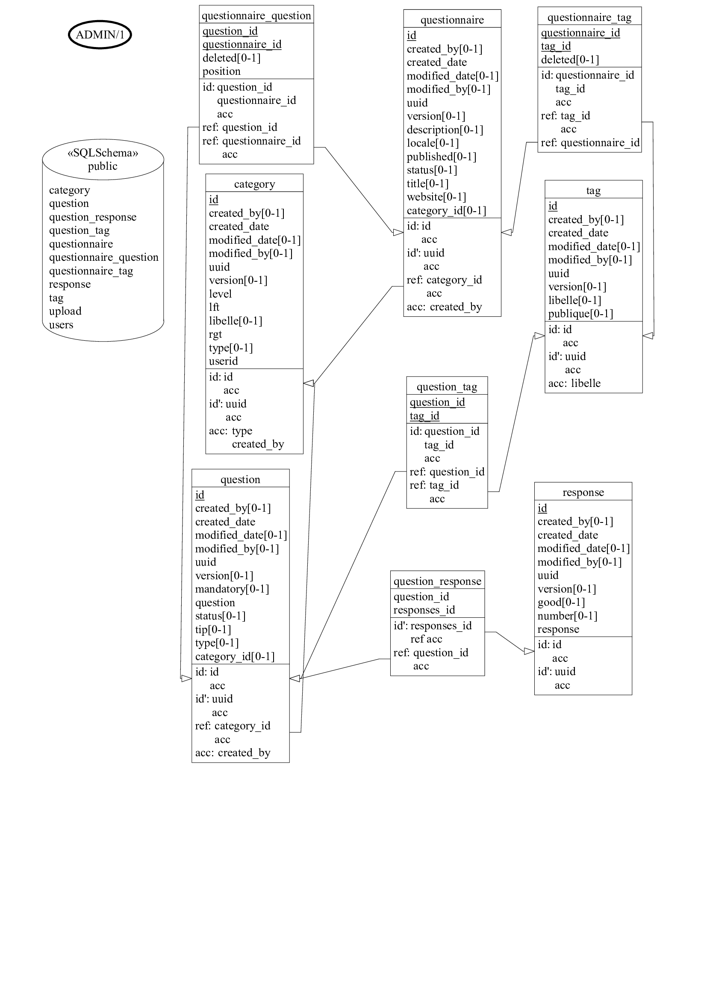

# Qcm Api  [](https://opensource.org/licenses/mit-license.php)
 

**qcm-rest-api is a sample QCM Rest API.**

You can also:
  
  - [ ]  Create some Questions.
  - [ ] Create some Questionnaires. 
  - [ ] Create some Categories.
  - [ ] Export as WORD,PDF
  - [ ] Import Questionnaires from file(s)

### Quality Gate
 [](https://travis-ci.com/EricMuller/qcm-rest-api)


[](https://frontend.code-inspector.com/public/project/13123/qcm-rest-api/dashboard)
[](https://frontend.code-inspector.com/public/project/13123/qcm-rest-api/dashboard)


[](https://snyk.io/test/github/EricMuller/qcm-rest-api)

[](https://sonarcloud.io/dashboard/index/com.emu.apps.qcm:qcm-rest-api) 
[](https://sonarcloud.io/component_measures?id=com.emu.apps.qcm%3Aqcm-rest-api&metric=bugs) 
[](https://sonarcloud.io/component_measures?id=com.emu.apps.qcm%3Aqcm-rest-api&metric=code_smells) 
[](https://sonarcloud.io/component_measures?id=com.emu.apps.qcm%3Aqcm-rest-api&metric=duplicated_lines_density)
[](https://sonarcloud.io/component_measures?id=com.emu.apps.qcm%3Aqcm-rest-api&metric=coverage)
[](https://sonarcloud.io/component_measures?id=com.emu.apps.qcm%3Aqcm-rest-api&metric=vulnerabilities)

[](https://bestpractices.coreinfrastructure.org/projects/2888)

### Tech

qcm-rest-api uses a number of open source projects to work properly:

* [SpringBoot] - Create stand-alone backend Spring applications
* [Spring Mvc] -  Framework provides Model-View-Controller (MVC) architecture
* [Spring Data JPA]  - Provides repository support for the Java Persistence API (JPA)
* [MapStruct] - code generator that greatly simplifies the implementation of mappings between Java bean types  
* [keycloak] - an open source identity and access management solution
* [Lombok] - Never write another getter or equals method again
* [JaCoCo] - JaCoCo is a free code coverage library for Java.
* [Xdocreport] - XML Document reporting.

### Continuous integration

* [Maven] - the build system
* [Docker] - Open platform for developing, shipping, and running applications [docker.com](https://www.docker.com/)
* [Travis] - Test and Deploy with Confidence [travis-ci](https://travis-ci.com/EricMuller/qcm-rest-api)
* [SonarQube] - SonarQube on [sonarcloud.io](https://sonarcloud.io/dashboard?id=com.emu.apps.qcm:qcm-rest-api) is an open-source platform for continuous inspection of code quality.
* [Heroku] - Fully managed container-based cloud platform, with integrated data services. [heroku.com](https://www.heroku.com)
* [Snyk] - Finding & fixing vulnerabilities in your dependencies. [snyk.io](https://snyk.io)


### Documentations

* [SwaggerHub](https://app.swaggerhub.com/apis-docs/ericmuller/qcm-rest-api/2-oas3) - Collaborative platform where you can define your APIs using the OpenAPI Specification


### Essential prerequisite

qcm-rest-api requires Postgres 10.2


> docker run --name qcm-postgres -p 5433:5432 -e POSTGRES_PASSWORD=postgres -d postgres:10.12


### Installation dev

qcm-rest-api requires [MAVEN](https://maven.apache.org/) v3.3+ to run.

Install the dependencies and devDependencies and start the server.

```sh
$ cd qcm-rest-api
$ maven clean install
$ maven spring-boot:run
```

Verify the deployment by navigating to your server address in your preferred browser.


> http://127.0.0.1:8080/swagger-ui.html#/
### build with Cloud Native Buildpacks

mvn spring-boot:build-image -Dspring-boot.build-image.imageName=qcm/qcm-app:latest

echo "$PASSWORD" | docker login --username ericmuller --password-stdin

~~docker image push nexus.webmarks.net:5000/qcm/qcm-app:latest~~

docker image push ericmuller/qcm-app:latest


###Docker


1. keycloak

> docker run --name qcm-keycloak -p 8082:8082 -e KEYCLOAK_USER=admin -e KEYCLOAK_PASSWORD=admin quay.io/keycloak/keycloak:13.0.0


2. postgres

> docker run --name qcm-postgres -p 5433:5432 -e POSTGRES_PASSWORD=postgres -d postgres:10.12

> docker run --name qcm-db-postgres --hostname=qcm-db-srv --network=qcm-app-network -d -p 5432:5432 -e POSTGRES_PASSWORD=postgres  --restart unless-stopped postgres:10.12

3. api

> docker run  --name qcm-app-2.2.0-SNAPSHOT  --hostname=qcm-app-srv --network=qcm-app-network -d -p 8081:8081  docker.io/webmarks/qcm-app:2.2.0-SNAPSHOT


###Maven

> maven clean install -Dmaven.test.skip=false

> maven verify sonar:sonar


### Deployment

<a href="https://qcm-rest-api.herokuapp.com/swagger-ui.html#" target="_blank"></a>


> $ curl https://qcm-rest-api.herokuapp.com/ ...


### Todos

 - Write more features
 - Batch import with [Apache Kafka] - Distributed streaming platform
 - Add Throttling
 
 
### License


Code is under the [MIT Licence ](https://opensource.org/licenses/mit-license.php).

### Architecture

Three agents:
- User Side (who pilots)
- Server Side (who is piloted, driven)
- Business Logic (hexagone)


### Mcd



### Some Technical Notes 


[Date Format in REST API](http://apiux.com/2013/03/20/5-laws-api-dates-and-times/) 

    The 5 laws of API dates and times in rest api:

    - Law #1: Use ISO-8601 for your dates 
    - Law #2: Accept any timezone
    - Law #3: Store it in UTC
    - Law #4: Return it in UTC
    - Law #5: Don’t use time if you don’t need it


[Google JSON Style Guide](https://google.github.io/styleguide/jsoncstyleguide.xml?showone=Property_Name_Format#Property_Name_Format) (recommendations for building JSON APIs at Google),

     It recommends that:

     - Property names must be camelCased, ASCII strings.

     - The first character must be a letter, an underscore (_) or a dollar sign ($).

## jpa
@UniqueConstraint allows you to name the constraint, while @Column(unique = true) generates a random name (e.g. UK_3u5h7y36qqa13y3mauc5xxayq).
